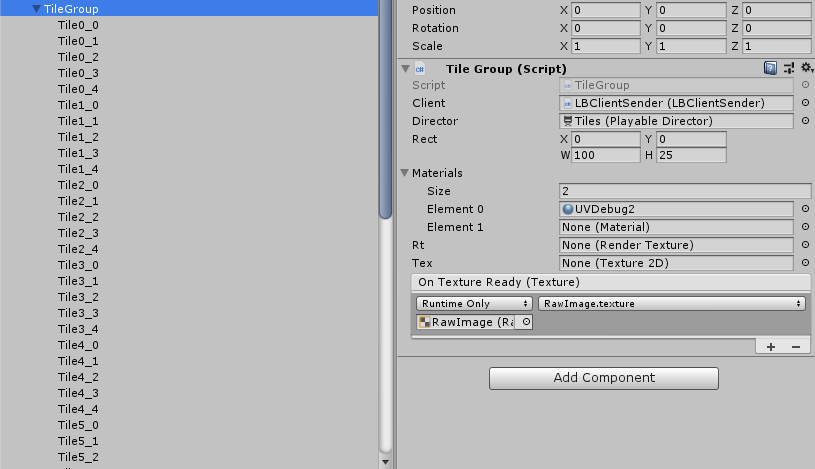
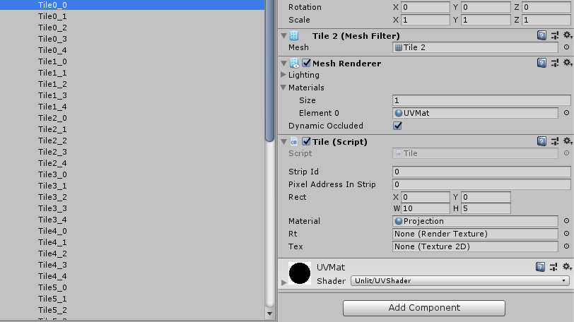

## TileGroup

This components is the main glue between the rendering and the LED clients.

It's responsible for rendering it's children (tiles) to a `RenderTexture`, it reads the content back (via `Texture2D.ReadPixels` & `Texture2D.GetPixels32`), cuts it according to each `Tile`'s rectangle and passes it to the client (**LBClientSender**).

> Many TileGroups can be connected to the same client, for but for performance reasons fewer is better.

The `Rect` member is the offset and size in pixels\triangles. It determines the size of the render target and shifts the UV for all in child tiles.
It's width and height (W&H) must match the number of pixels it renders.

> e.g, In the image there are 5x10 (*rows* x *cols*) tiles (not all columns visible), each tile is 5x10 (*rows* x *cols*) pixels, so it renders 100x25 (*cols* x *rows*) pixels, **W**=10x10, **H**=5x5.

Should there be another `TileGroup` to the right of this one, it's **X** would be 100.

Tiles themselves work in a similar way, see next section.

Other parameters, which are related to rendering more than the mapping:

`Material[]` **Materials** are used to render tiles with, in order (can be blended), these will be switched in the timeline.

`RenderTexture` **Rt** is the render target for this group, is created according to the width and height of the `Rect` member.

`Texture2D` **Tex** is used to read back pixels from the GPU.

`UnityEvent<Texture>` **OnTextureReady** is fired once the texture is created.

This components also sends the average color to the control LED on the board (pixelAddressInStrip = 0).

## Tile

`ushort` stripId is a parameter for `LBClientSender.SetData`, maps to a GPIO port. There are usually 5 tiles per strip, as in the image.

`ushort` pixelAddressInStrip is the offset in pixels (triangles\LEDs) for this tile within a strip. Will be in multiples 50 (for tile size 5x10).

**Rect** is much like in the `TileGroup`, so a tile to the right will have x+10, tile above will have y+5.
This affects only how they are rendered (their UV), but combined with the `pixelAddressInStrip` its maps a virtual tile to a physical one.

Physical tiles are usually connected vertically, from bottom to top, so values for the **X**, **Y** and **Px** (pixel address) of the first two strips should look like this:

*(Top, with a dangling data cable)*

|Strip 0|||-||Strip 1||||
|-|--|--|---|-|-|--|--|---|
|**X**|**Y**|**Px**|-|**X**|**Y**|**Px**|
|0|20|200|-|5|20|200|
|0|15|150|-|5|15|150|
|0|10|100|-|5|10|100|
|0|5 |50 |-|5|5 |50 |
|0|0 |0  |-|5|0 |0  |

*(Bottom, power and data cables to controller)*

Each tile also has a reference for it's parent's `RenderTexture` as well as a `Texture2D` used for debugging.
