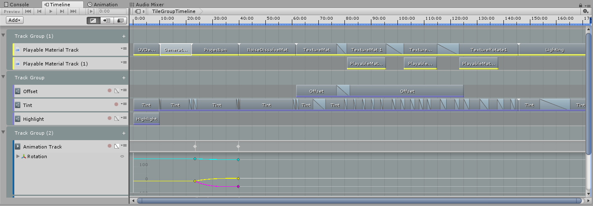
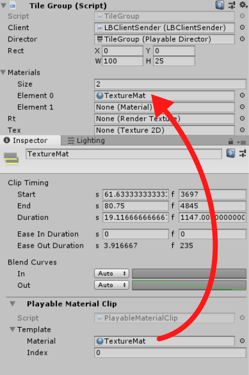

# Timeline

Unity's [Timeline](https://docs.unity3d.com/Manual/TimelineOverview.html) is a very powerful and robust tool and is used for animating the visuals.

It comes with a few standard track types, like *Animation Track* which can record and edit animations, but can also be extended with custom track types.

First of which, as seen in the first track group in the image (yellow clips) is a custom track that controls the materials of a `TileGroup`.

You must first assign a `TileGroup` in the left side, then right-click the timeline and add select "Add Playable Material Clip".
Select the clip, and expand it's **Template** member in the inspector.
Assign the **Material** to be switched.
The **Index** is the index of the `TileGroup`'s material array to switch (within array bounds).

In the image below you can see The inspectors for the `TileGroup` and the clip, and how **TextureMat** is assigned to index 0 of the materials array.

Other then switching materials, the clips can also blend, which will set the `_Alpha` shader property for both materials so that they can cross-fade.

For instance, in the image at the top, **TextureMat** clip at index 0 is blended with **TextureMat1** which is at index 1. So that when they are rendered (in order) they appear to crossfade.

    When a cross-fade is done, you should add a clip with an empty material, this will null the array element, causing it not to render and increase performance.

Second track group in image has tracks that control shader parameters, 
see [Playable Shader Globals](https://github.com/slipster216/PlayableShaderGlobals) for more info.

Third track group has a standard animation track.
