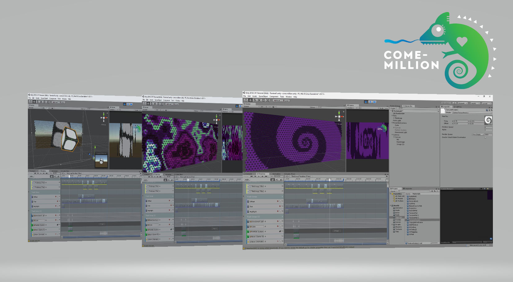

# come-million-unity
This is the unity software that runs the light show - where visuals are rendered and sent to the LED controllers.

## What you'll need:
Unity 2018.1 (or at least 2017.1)

## What you can do:
Animations can be authored in serveral ways:
- Unity scenes projected on the tiles, this is a great option for 3D artists and animators and Unity beginners too!
- Written with custom shaders, for those who like their hands dirty.
- or using simple images and transitions, fun for everyone!

Animations are then merged and sequenced on a timeline.
                                  

TODO:
Explain, more... a lot more.

                       
